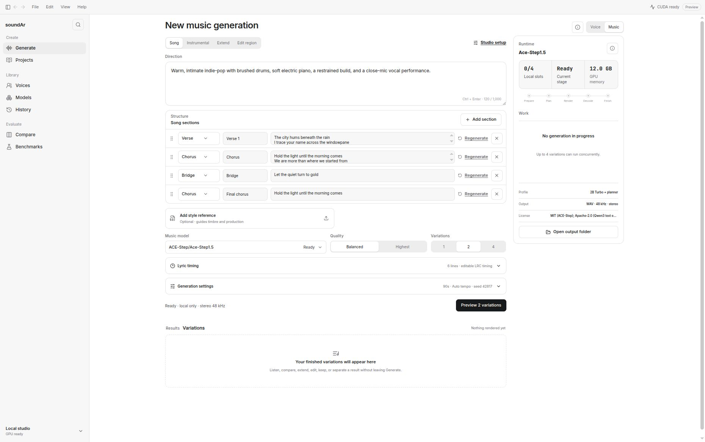

<p align="center">
  
</p>

<h1 align="center">soundAr</h1>

<p align="center">
  A local-first Linux studio for turning text into speech and music.
</p>

<p align="center">
  <a href="https://github.com/theoyinbooke/soundAr/releases/latest"></a>
  <a href="https://github.com/theoyinbooke/soundAr/actions/workflows/ci.yml"></a>
  <a href="LICENSE"></a>
  
</p>

soundAr is an open-source desktop application for high-quality, private audio generation. It keeps inference, projects, model files, and generated audio on your machine. There is no cloud inference, API-key dependency, telemetry requirement, or online fallback.



## What you can do

- Generate speech from plain text, SSML, or batch inputs with local voice models.
- Build longer work in chapter-based Projects and render chapters independently.
- Create songs or instrumentals with ACE-Step 1.5 Studio, including structured sections and editable lyric timing.
- Extend audio, edit a selected region, use permitted style or source references, and generate multiple variations.
- Play, compare, keep, retry, export, or separate completed results without leaving Generate.
- Manage installed models and isolated runtimes without bundling model weights into the app.
- Review generation history, compare voices, and run reproducible local benchmarks.
- Queue independent jobs through a durable, GPU-aware scheduler or the optional loopback API.
- Describe an unfinished creative goal to the integrated assistant and let it research, plan, write, generate, review, and revise the complete soundAr workflow with you.

The interface is designed for Linux as a compact, resizable, light-first desktop workspace. Tauri 2 provides the native shell; React 19 renders the application UI; isolated Python workers keep supported models warm between jobs.

## Install on Linux

Download and run the installer from the latest signed GitHub release:

```bash
curl -fsSLO https://github.com/theoyinbooke/soundAr/releases/latest/download/install-linux.sh
chmod +x install-linux.sh
./install-linux.sh
```

The installer adds the Debian package and prepares soundAr's managed Python runtime. Administrative authentication is requested by the system package installer when required. Runtime and model data remain outside the application package, so upgrades preserve installed models, projects, and generated audio.

To install a package built locally:

```bash
./install-linux.sh app/src-tauri/target/release/bundle/deb/soundAr_0.5.1_amd64.deb
```

### Storage and updates

- Managed Python runtimes: `${XDG_DATA_HOME:-$HOME/.local/share}/soundar/runtime`
- Model weights, the SQLite library, and exports: `~/.soundAr`
- AppImage builds can update and restart in place after signature verification.
- Debian builds show an update notice and continue through the system package installer.

Installing, opening, or updating soundAr never downloads model weights. A model download starts only after you review its upstream source, pinned revision, license, access conditions, storage requirement, and hardware fit in Models.

## Speech studio

Generate speech with model-aware controls for voice, language, pacing, sampling, cloning support, and output format. The current curated catalog includes Kokoro-82M, Chatterbox and Chatterbox Turbo, SpeechT5, Breeze TTS 2, and Fish Speech 1.5. Availability and allowed use differ by model.

Independent generations, project chapters, and batch rows use one durable scheduler. Jobs move through queued, in-progress, and completed states; supported actions include pause, resume, cancel, retry, dismiss, playback, and export. The default concurrency ceiling is four workers and can be changed from 1 to 8 with `SOUNDAR_MAX_PARALLEL_JOBS`; GPU admission is additionally bounded by declared VRAM requirements and current free memory.

## Creative Producer

The optional Assistant pane connects to an existing Codex CLI installation and uses the ChatGPT account already managed by Codex. soundAr never installs Codex, reads its credential files, or asks for an API key. It searches the ordinary Linux executable locations and common Node, Rust, Flatpak, Snap, mise, nvm, fnm, pnpm, and user-local locations, then selects the newest valid installation so a stale launcher PATH cannot hide the current model catalog. `SOUNDAR_CODEX_BIN` or `CODEX_BIN` can intentionally pin an exact executable. When no valid installation is found, the pane explains what is missing without changing the machine.

The assistant is designed for goals, not just exact generation commands. It can:

- turn a rough idea into a visible production plan and research the context needed to improve it;
- write scripts, lyrics, directions, chapter structures, and batch content;
- inspect the local model, voice, project, scheduler, and generation state before choosing a route;
- queue speech, music, and batch work, create long-form projects, and follow durable jobs;
- surface completed audio as a compact player in the conversation, then preserve the creative brief while revising from feedback.

Read-only, Studio, and Full access modes control what the conversation can do. Read-only can inspect and plan. Studio can research and manage work inside soundAr's local studio. Full access exposes the broader machine capabilities of Codex and keeps approval prompts visible before sensitive actions.

## Music Studio

ACE-Step 1.5 Studio is the recommended music route. Its pinned local pack combines the 2B Turbo song model, 1.7B planner, 48 kHz stereo VAE, and text encoder. On a qualified 12 GB NVIDIA GPU, soundAr uses CPU offload to keep planning and decoding within the hardware envelope.

Music workflows include:

- **Song** — direction, structured Intro/Verse/Pre-chorus/Chorus/Bridge/Instrumental/Outro sections, lyrics, and editable LRC timing.
- **Instrumental** — direction-only generation without presenting text as lyrics.
- **Extend** — continue a generated or user-provided source after explicit source-rights confirmation.
- **Edit region** — repaint a selected time range while preserving the rest of the source.
- **Variations** — render one, two, or four alternatives concurrently and retain their seed, timing, model, and playback metadata.
- **Stems** — separate vocals, drums, bass, and other layers when the optional ACE-Step Base Tools checkpoint is installed.

The runtime reports Prepare, Plan, Render, Decode, and Finish stages, plus local slot use, ETA, GPU-memory feedback, cancellation, and completed playable results. The recommended Studio pack supports work from short drafts through longer compositions; actual speed depends on duration, workflow, model tier, and GPU.

MusicGen Small remains available for short instrumental drafts. Its weights are CC BY-NC 4.0 and it does not condition on lyrics. soundAr rejects unsupported lyric requests instead of presenting the result as sung text.

## Model and privacy policy

The MIT License covers soundAr's original source and bundled brand assets, not third-party models, datasets, or generated content. A catalog entry means the model has a qualified local integration; it does not mean the model is open source or cleared for every use.

- Model weights are never committed to this repository or bundled in a Debian/AppImage release.
- Downloads are explicit, revision-pinned, and recorded with a file manifest.
- Health checks validate installed files before an engine can use them.
- Generated artifacts are registered with byte length and SHA-256 checksum.
- Database upgrades create and verify a backup before migration.
- Voice or audio references require the rights and consent applicable to your use.

Read [Model and Data Licenses](MODEL_LICENSES.md) before downloading or distributing model artifacts.

## Development

Prerequisites are a current Node.js toolchain, Rust, Python 3.11, and the Linux libraries required by Tauri and native audio. Start the complete desktop application with:

```bash
cd app
npm install
npm run tauri dev
```

For frontend development with simulated generation results:

```bash
cd app
npm install
npm run dev
```

Open `http://127.0.0.1:1421`.

### Repository map

| Path | Purpose |
| --- | --- |
| `app/src/` | React workspace, design system, routes, and interaction state |
| `app/src-tauri/` | Native window, SQLite state, scheduler, updater, audio, and local API |
| `bridge.py` | Persistent JSON-lines inference worker with an engine-scoped warm cache |
| `core/` | Engine contracts, model registry, audio utilities, and benchmarks |
| `engines/` | Model-specific local speech and music adapters |
| `data/curated_models.json` | Versioned model catalog and qualification metadata |
| `docs/openapi.yaml` | Optional loopback API contract |

## Batch and local API

The Batch workspace and CLI accept TXT, CSV, and JSONL. Structured files can define a row name, deterministic output name, priority, model, voice, and supported generation settings. See [Batch input formats](docs/batch-formats.md).

After explicitly enabling the loopback API in Settings, use the token shown by soundAr:

```bash
export SOUNDAR_API_TOKEN='<token shown by soundAr>'
./soundar_cli.py batch scripts.txt --parallelism 2 --priority high
./soundar_cli.py scheduler
```

Queue, inspect, and retry durable jobs without blocking the client:

```bash
./soundar_cli.py queue "A durable local generation" --output output.wav
./soundar_cli.py job <job-id>
./soundar_cli.py retry <job-id>
```

The versioned API is documented in [`docs/openapi.yaml`](docs/openapi.yaml). Local clients can follow progress through resumable server-sent events at `GET /v1/jobs/<job-id>/events`.

## Verification

Run the source and desktop checks with:

```bash
./scripts/check-release-version.sh
python3.11 -m venv .test-venv
.test-venv/bin/pip install -r requirements-test.txt
.test-venv/bin/python -m unittest discover -s tests -v
cd app
npm test
npm run test:e2e
npm run build
../scripts/verify-production-boundary.sh
npm run test:production
cd src-tauri
cargo test --locked
```

GPU qualification uses the packaged runtime and user-installed pinned models. The ACE-Step acceptance script verifies consecutive cold and warm native-bridge renders, playable 48 kHz stereo output, durable history metadata, unload, and scheduler quiescence:

```bash
./scripts/run-packaged-acestep-acceptance.sh
```

Release evidence ownership and manual gates are documented in the [test matrix](docs/test-matrix.md) and [release checklist](docs/release-checklist.md).

## Releases

Version tags build signed Debian and AppImage artifacts in GitHub Actions. The release workflow runs source, UI, native, package, and clean-download checks; generates checksums and build provenance; and publishes only after those gates pass.

- [Latest release](https://github.com/theoyinbooke/soundAr/releases/latest)
- [Changelog](CHANGELOG.md)
- [Roadmap](ROADMAP.md)

## Contributing and security

Contributions are welcome. Read [CONTRIBUTING.md](CONTRIBUTING.md) before opening a pull request. Report vulnerabilities through the private process in [SECURITY.md](SECURITY.md), not a public issue.

soundAr source code and bundled brand assets are available under the [MIT License](LICENSE).
